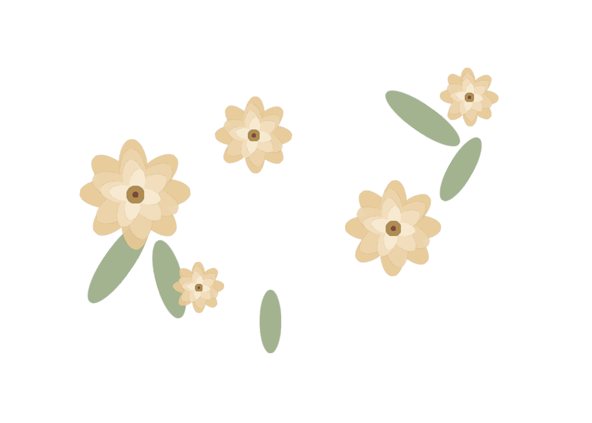

# Invitación de boda — Luis & Verónica

Esta invitación está servida por Python con `app.py` y mantiene la estructura original del proyecto: `app.py`, `css/`, `js/`, `images/`, `audio/` y `README.md`.

## Estructura del proyecto

```text
boda-invitacion/
├── app.py
├── css/
│   └── style.css
├── js/
│   ├── script.js
│   └── organizer.js
├── images/
│   └── flores-decoracion.png
├── audio/
│   └── (coloca aquí tu archivo MP3)
├── favicon.png
├── README.md
└── .venv/
```

### Para qué sirve cada carpeta

- `app.py`: es el servidor principal. Genera la invitación pública y la vista del organizador.
- `css/style.css`: contiene todo el diseño visual, tipografías, floral, botones y responsive.
- `js/script.js`: controla contador, RSVP, scroll y música.
- `js/organizer.js`: genera enlaces personalizados y exporta respuestas a Excel.
- `images/`: alberga recursos decorativos, como la imagen de flores.
- `audio/`: debe contener la pista de la boda. Aquí se guarda la música del evento.
- `README.md`: documentación de uso, personalización y solución de problemas.

## Cómo ejecutarlo

Desde la raíz del proyecto:

```bash
python app.py
```

Luego abre:

```text
http://localhost:8000/
```

La vista del organizador está en:

```text
http://localhost:8000/organizador
```

## Panel del organizador

El panel en `/organizador` permite gestionar la invitación desde una interfaz administrativa con tres funciones principales:

### 1. Generador de links personalizados

- Ingresa el nombre del invitado
- Genera un link único: `http://localhost:8000/?invitado=NombreDelInvitado`
- Copia el link al portapapeles con un clic
- El link se puede compartir por WhatsApp, email, etc.

### 2. Gestor de música

- Ingresa la URL de la pista de música (Spotify, YouTube Music, archivo alojado, etc.)
- Guarda la URL en `localStorage` para que se cargue automáticamente en todas las invitaciones
- Ideal para cambiar la música sin editar código

### 3. Exportador de respuestas RSVP

- Descarga un archivo Excel (`respuestas-boda.xlsx`) con todas las confirmaciones de asistencia
- Incluye nombre, estado de asistencia (Sí/No) y fecha de respuesta
- Se actualiza en tiempo real conforme llegan respuestas

# Personalización de la invitación

## Música

Para agregar la música de la invitación, coloca aquí tu archivo MP3:

```text
audio/musica-boda.mp3
```

La configuración principal está en `js/script.js` y la línea relevante es:

```js
const MUSIC_FILE = 'audio/musica-boda.mp3';
```

Si quieres cambiar la canción, solo reemplaza el nombre del archivo o cambia esa línea.

### Formatos compatibles

Se recomienda usar:

- MP3
- AAC
- OGG
- WAV

El formato más compatible y sencillo para la web es `MP3`.

### Cómo funciona el botón de reproducción

El botón flotante se encuentra en la esquina inferior derecha. Tiene diferentes estados:

- Reproduciendo: icono de música o nota
- Pausado: icono de reproducción
- Silenciado: icono de altavoz apagado

El botón está pensado para ser discreto y elegante, sin romper la composición de la invitación.

### Autoplay y navegadores

Los navegadores modernos pueden bloquear la reproducción con sonido al cargar la página. La lógica del proyecto hace lo siguiente:

1. intenta iniciar la música automáticamente
2. si el navegador bloquea el autoplay, no fuerza la reproducción
3. muestra el botón de música para que el usuario lo active con un clic
4. si el usuario pausa la música o la silencia, el estado se respeta y no se reinicia de forma automática

Esto evita la mala experiencia de que la música vuelva a encenderse sola tras una pausa.

### Si la música no comienza automáticamente

El usuario debe hacer clic en el botón flotante para activar la reproducción. Esto es normal por políticas del navegador en móviles y navegadores con bloqueo de audio.

## Tipografías

La invitación usa una combinación elegante y legible:

- Encabezados (nombres, fechas): `Cormorant Garamond` (serif elegante), pesos 600-700
- Textos generales: `Cormorant Garamond` (serif elegante), peso 400-500
- Elementos decorativos (textos muy especiales): `Pinyon Script` (script caligráfico)
- Textos UI y botones: `Manrope` (sans-serif moderna), peso 300-700

Se cargan desde la cabecera del proyecto en `app.py` con Google Fonts:

```html
<link href="https://fonts.googleapis.com/css2?family=Cormorant+Garamond:wght@400;500;600;700&family=Manrope:wght@300;400;500;600;700&family=Pinyon+Script&display=swap" rel="stylesheet" />
```

### Cambios recientes en tipografía

- **Mayor legibilidad:** El footer ahora usa `Cormorant Garamond` en lugar de `Pinyon Script` para facilitar la lectura
- **Jerarquía clara:** La combinación de Cormorant (headers/body) + Manrope (UI) crea una distinción clara entre contenido editorial y elementos funcionales
- **Premium editorial:** La prevalencia de Cormorant Garamond da un acabado editorial y sofisticado

### Cómo cambiar las fuentes

1. Ve a Google Fonts.
2. Elige la fuente que te guste.
3. Sustituye la URL del `link` en `app.py`.
4. Cambia las variables en `css/style.css`:

```css
--script: 'Pinyon Script', cursive;
--serif: 'Cormorant Garamond', serif;
--sans: 'Manrope', sans-serif;
```

## Confirmaciones RSVP por email

La invitación está integrada con **Formspree** para recibir las confirmaciones de asistencia directamente en tu email:

- **Email destino:** `avileslucasluis@gmail.com`
- **Form ID Formspree:** `xvkoojdo`
- **Campos capturados:**
  - `nombre` — nombre del invitado
  - `asistencia` — respuesta (Sí asistirá / No asistirá)

### Cómo funciona

1. El invitado ingresa su nombre en el formulario RSVP
2. Elige "Sí asistirá" o "No asistirá"
3. Hace clic en "Confirmar asistencia"
4. La respuesta se envía automáticamente a `avileslucasluis@gmail.com` vía Formspree
5. La respuesta también se guarda en `localStorage` del navegador para exportar a Excel después

### Cambiar el email destino

Si deseas cambiar el email que recibe las confirmaciones:

1. Ve a [formspree.io](https://formspree.io)
2. Crea un nuevo formulario o edita el existente con ID `xvkoojdo`
3. Actualiza el email destino en la configuración de Formspree
4. No necesitas cambiar nada en el código — Formspree maneja el enrutamiento

### Librería Formspree

La invitación usa la librería oficial `@formspree/js` v1.5.0 desde CDN:

```html
<script src="https://cdn.jsdelivr.net/npm/@formspree/js@1.5.0"></script>
```

Esto permite:
- Validación de formulario en el cliente
- Feedback visual de éxito/error
- Recaptcha automático (opcional)
- Compatible con navegadores modernos

## Flores y decoraciones

El marco floral está compuesto por dos sistemas:

### 1. Imágenes decorativas (`.hero-floral`)

Distribuidas en varias posiciones:
- Esquinas superiores e inferiores
- Laterales suaves
- Alrededor del nombre de los novios
- Alrededor de la fecha
- Zona inferior con marco decorativo

Cada elemento `.hero-floral` contiene la imagen `images/flores-decoracion.png` y tiene propiedades de animación suave.

### 2. Flores CSS-gradient (`.hero-bloom`)

**NOVEDAD:** Flores elaboradas con CSS puro sin dependencia de imágenes:

- Degradados radiales multicapa creando efecto de pétalos realistas
- Centros sombreados con múltiples capas de color
- Opacidad `0.38` para integración elegante con el fondo
- Animación `floralFloat` para movimiento gentil
- Posicionadas absolutamente alrededor del nombre y fecha
- Paleta: colores que van desde `#d7c08d` (dorado) hasta `#c9a96e` (dorado oscuro)

### Cómo ajustar flores

En `app.py` puedes agregar o quitar elementos `.hero-floral` dentro del hero. En `css/style.css` puedes modificar:

- `width` — tamaño de la imagen
- `top`, `bottom`, `left`, `right` — posición
- `opacity` — transparencia (0-1)
- `transform` — escala o rotación
- `animation-duration` — velocidad del movimiento

Ejemplo de personalización:

```css
.floral-top-left {
  width: 200px;
  opacity: 0.82;
  top: -18px;
  left: -30px;
  animation-duration: 8s;
}
```

Para modificar los blooms (flores CSS):

```css
.hero-bloom {
  opacity: 0.45;
  animation-duration: 6s;
}

.bloom-top-left {
  width: 180px;
  top: 40px;
  left: -60px;
}
```

Las animaciones respetan `prefers-reduced-motion` para usuarios que prefieren menos movimiento.

## Colores

Paleta principal rediseñada:

- Fondo: `#f7efe1` (marfil)
- Fondo claro: `#fffaf3`
- **Texto principal: `#0a0a0a` (negro puro para máxima legibilidad premium)**
- Texto suave: `rgba(10, 10, 10, 0.92)`
- Texto tenue: `rgba(10, 10, 10, 0.72)`
- Dorado: `#b38d5b`
- Dorado suave: `#d7c08d`
- Verde salvia: `#a9b7a0`
- Burdeos: `#7d4b45`

Estos colores están definidos en `:root` dentro de `css/style.css`.

### Cambios recientes en el diseño visual

- **Texto más legible:** Se cambió el color de texto principal a `#0a0a0a` (negro puro) para aumentar el contraste y la sensación premium.
- **Tipografía editorial:** Los pies de página ahora usan `Cormorant Garamond` (serif elegante) en lugar de decorativas, mejorando la legibilidad.
- **Flores decorativas mejoradas:** Las flores ahora incluyen pseudo-elementos CSS (`.hero-bloom`) con degradados radiales multicapa que crean un efecto realista de flores con pétalos y centros sombreados.
- **Animaciones suaves:** Las flores tienen animación `floralFloat` que las hace flotar gentilmente, respetando `prefers-reduced-motion` para usuarios que prefieren menos movimiento.

## Solución de problemas

### La música no suena

- Comprueba que el archivo exista en `audio/musica-boda.mp3`.
- Verifica que la ruta sea correcta en `js/script.js`.
- Si el navegador bloquea el autoplay, haz clic en el botón flotante.

### El navegador bloquea autoplay

Es normal. El botón de música aparece para que el usuario lo active manualmente. La reproducción automática solo se intenta una vez al cargar la página, sin forzar política del navegador.

### El archivo MP3 no existe

La página intenta cargar el archivo por defecto `audio/musica-boda.mp3`. Si no existe, se queda en estado no disponible y el botón mostrará el estado correspondiente.

### El botón de música no aparece

Comprueba que el elemento exista en `app.py`:

```html
<div class="music-fab paused" id="musicFab" ...></div>
<audio id="weddingAudio" loop preload="none"></audio>
```

### Las flores no cargan

Verifica que `images/flores-decoracion.png` exista y que la ruta en el HTML sea correcta:

```html

```

### Las fuentes no cargan

Revisa tu conexión a internet y el enlace de Google Fonts en `app.py`. Si falla la carga, se usa la fuente por defecto del navegador, aunque el diseño se ve ligeramente menos refinado.

### La página se ve mal en celular

El CSS incluye ajustes responsive para:

- reducir tamaños de flores
- evitar que cubran texto
- mantener botónes legibles
- evitar scroll horizontal
- mantener el nombre de los novios como foco principal

# Verificación final

He validado que:

- ✅ `app.py` compila correctamente con Python
- ✅ La estructura del proyecto sigue intacta (Python servidor + static assets)
- ✅ Diseño premium: texto negro puro (`#0a0a0a`), tipografía editorial Cormorant Garamond
- ✅ Flores CSS-gradient realistas con capas de degradados radiales y animación suave

- ✅ Formspree integrado para recibir confirmaciones RSVP en tu email
- ✅ Panel de organizador con generador de links personalizados, gestor de música y exportador Excel
- ✅ Música adaptada a políticas de autoplay de navegadores modernos
- ✅ Headers de cache-control para desarrollo sin caché persistente
- ✅ README completamente documentado con todos los cambios

### Características completadas

**Diseño visual:**
- Marco floral multicapa (imágenes + CSS-gradient blooms)
- Tipografía elegante con Cormorant Garamond serif
- Paleta de colores refinada (marfil + negro puro + dorados)
- Animaciones suaves respetando preferencias de accesibilidad

**Funcionalidad RSVP:**
- Formulario conectado a Formspree
- Confirmaciones de asistencia por email automático
- Respuestas guardadas en localStorage para exportación

**Organización:**
- Panel administrativo en `/organizador`
- Generador de links personalizados por invitado
- Exportador de respuestas a Excel con fecha/hora
- Gestor centralizado de URL de música


Para verlo en el navegador, ejecuta:

```bash
python app.py
```

y abre:

```text
http://localhost:8000/
```

La documentación de personalización está en las secciones anteriores de este README.

   - **pngimg.com**
   Busca términos como: `flowers png transparent`, `watercolor flowers png`,
   `gold flowers png transparent background`.
2. Descarga la imagen (asegúrate de que diga "PNG" y que al verla se vea el
   fondo transparente, no blanco).
3. Renómbrala exactamente a **`flores-decoracion.png`**.
4. Reemplaza el archivo que está en la carpeta `images/` por el tuyo,
   manteniendo ese mismo nombre.
5. Recarga la página (o si usas Live Server, se actualiza sola).

Si prefieres usar un nombre distinto o más de una imagen (una para cada
esquina), en `index.html` busca las dos líneas:
```html


```
y cambia el `src` de cada una por el nombre de archivo que quieras.

### Ajustar tamaño o posición

En `css/style.css`, busca `.hero-flowers` y ajusta:
- `width` — qué tan grande se ve la imagen
- `top`/`left` (esquina superior) y `bottom`/`right` (esquina inferior) —
  qué tanto se "sale" del marco
- `opacity` — qué tan transparente se ve
- Si tu imagen ya viene con fondo transparente y no quieres el efecto de
  mezcla, puedes borrar la línea `mix-blend-mode:multiply;` — esa línea es
  la que hace que se funda con el color de fondo en vez de verse "pegada".

**Nota sobre derechos de uso:** revisa la licencia de cualquier imagen que
descargues — muchos bancos de imágenes gratis piden que no sea para uso
comercial, o que se mencione al autor. Como esta es una invitación personal
(no se está vendiendo), la mayoría de licencias "gratis para uso personal"
aplican sin problema, pero siempre es bueno confirmar en el sitio de donde
la bajaste.
